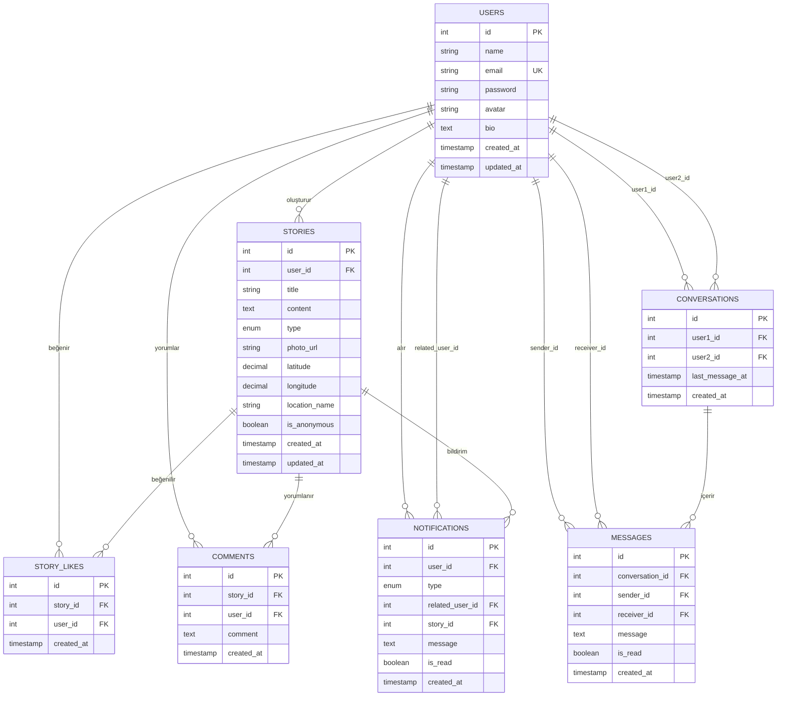

# TraceMark Veritabanı ER Diyagramı

## Mermaid ER Diagram Kodu

## Tablo İlişkileri Özeti

1. **USERS** → **STORIES** (1:N): Bir kullanıcı birden fazla hikaye oluşturabilir
2. **USERS** → **CONVERSATIONS** (N:M): İki kullanıcı arasında konuşma
3. **CONVERSATIONS** → **MESSAGES** (1:N): Bir konuşmada birden fazla mesaj
4. **STORIES** → **STORY_LIKES** (1:N): Bir hikaye birden fazla beğeni alabilir
5. **STORIES** → **COMMENTS** (1:N): Bir hikayeye birden fazla yorum yapılabilir
6. **USERS** → **NOTIFICATIONS** (1:N): Bir kullanıcı birden fazla bildirim alabilir

