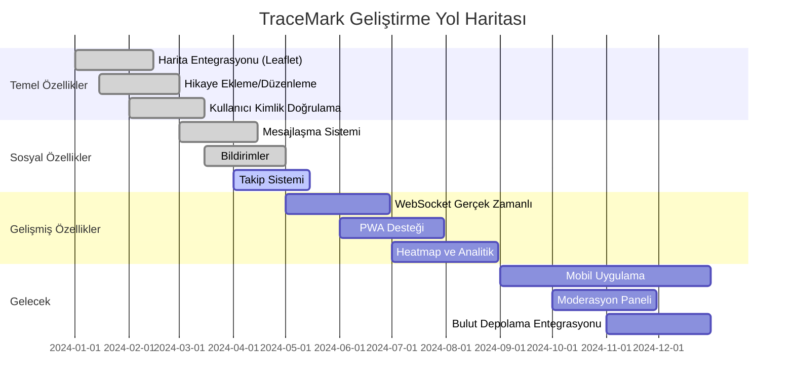

# TraceMark Yol Haritası

## Mermaid Timeline Diagram



## Timeline Görsel Şeması (Metin Formatı)

```
┌─────────────────────────────────────────────────────────────────┐
│                    TRACEMARK YOL HARİTASI                        │
└─────────────────────────────────────────────────────────────────┘

2024 Q1 (Ocak-Mart) ✅ TAMAMLANDI
├─ Harita Entegrasyonu (Leaflet.js)
├─ Hikaye Ekleme/Düzenleme/Silme
├─ Kullanıcı Kayıt/Giriş (JWT)
└─ Temel Profil Sistemi

2024 Q2 (Nisan-Haziran) 🔄 DEVAM EDİYOR
├─ Mesajlaşma Sistemi ✅
├─ Bildirimler ✅
├─ Takip Sistemi 🔄
└─ Beğeni ve Yorumlar ✅

2024 Q3 (Temmuz-Eylül) 📅 PLANLANDI
├─ WebSocket ile Gerçek Zamanlı Bildirimler
├─ PWA (Progressive Web App) Desteği
├─ Offline Okuma Özelliği
└─ Push Notification Entegrasyonu

2024 Q4 (Ekim-Aralık) 📅 PLANLANDI
├─ Heatmap Görselleştirme
├─ Zaman Tüneli Filtreleri
├─ Kullanıcı Analitikleri
└─ Gelişmiş Arama Algoritması

2025 Q1 (Ocak-Mart) 🔮 GELECEK
├─ Mobil Uygulama (React Native)
├─ Moderasyon Paneli
├─ Raporlama Sistemi
└─ Bulut Depolama (S3) Entegrasyonu
```

## Özellik Öncelik Matrisi

```
YÜKSEK ÖNCELİK (Kritik)
├─ ✅ Harita ve Hikaye Sistemi
├─ ✅ Kullanıcı Kimlik Doğrulama
├─ ✅ Mesajlaşma
└─ 🔄 Takip Sistemi

ORTA ÖNCELİK (Önemli)
├─ 📅 WebSocket Bildirimler
├─ 📅 PWA Desteği
└─ 📅 Heatmap

DÜŞÜK ÖNCELİK (Gelecek)
├─ 🔮 Mobil Uygulama
├─ 🔮 Moderasyon Paneli
└─ 🔮 Bulut Depolama
```

